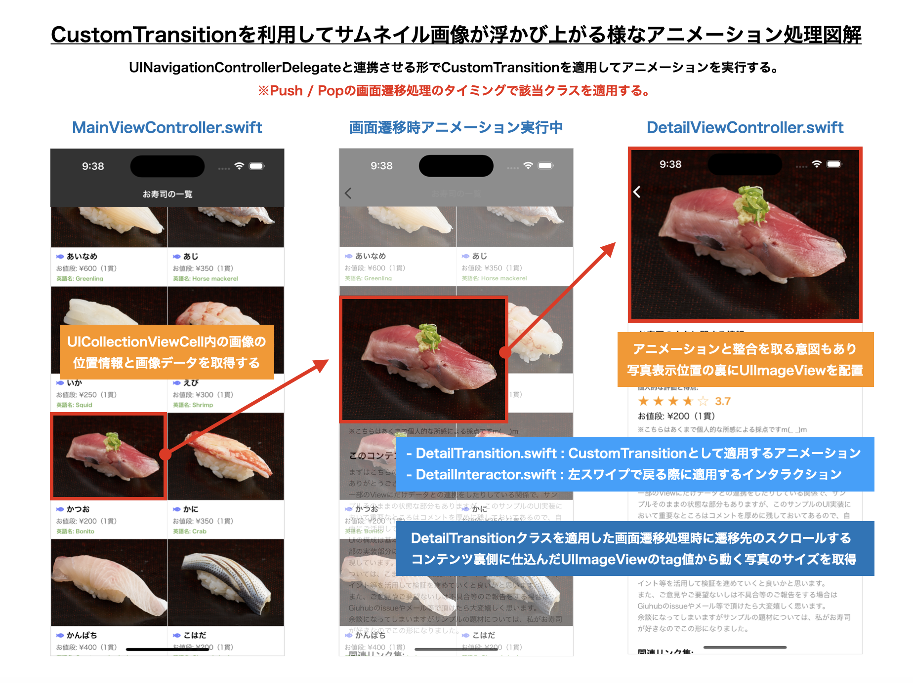
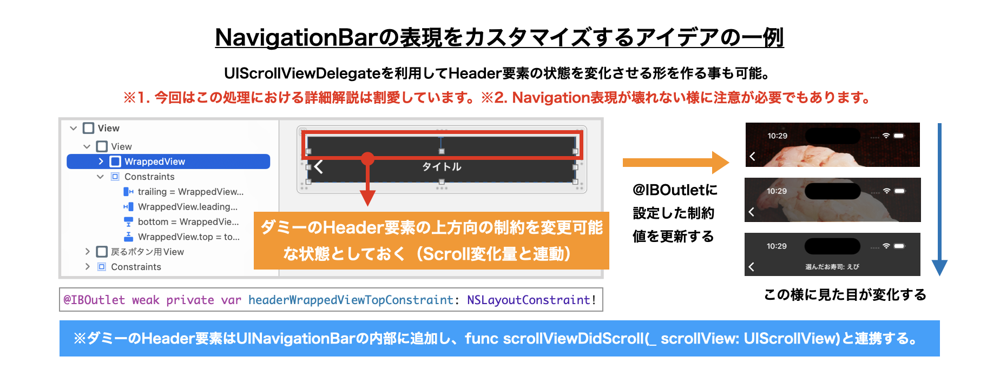
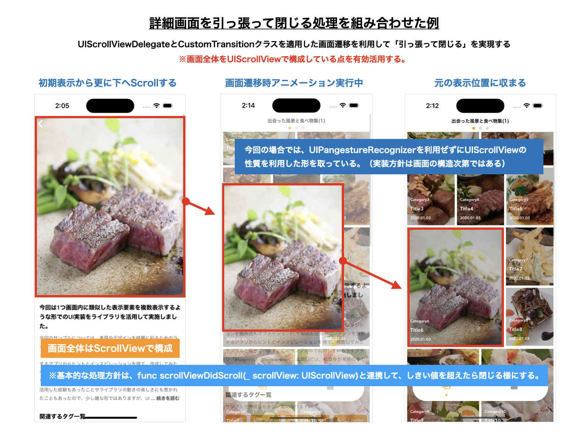
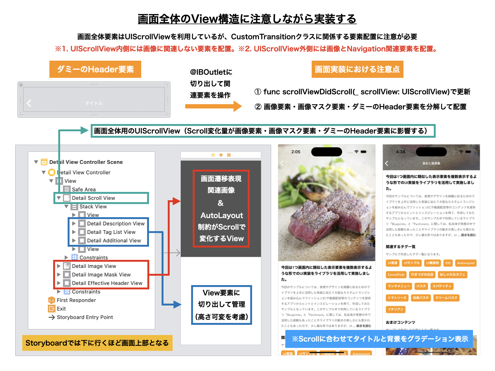
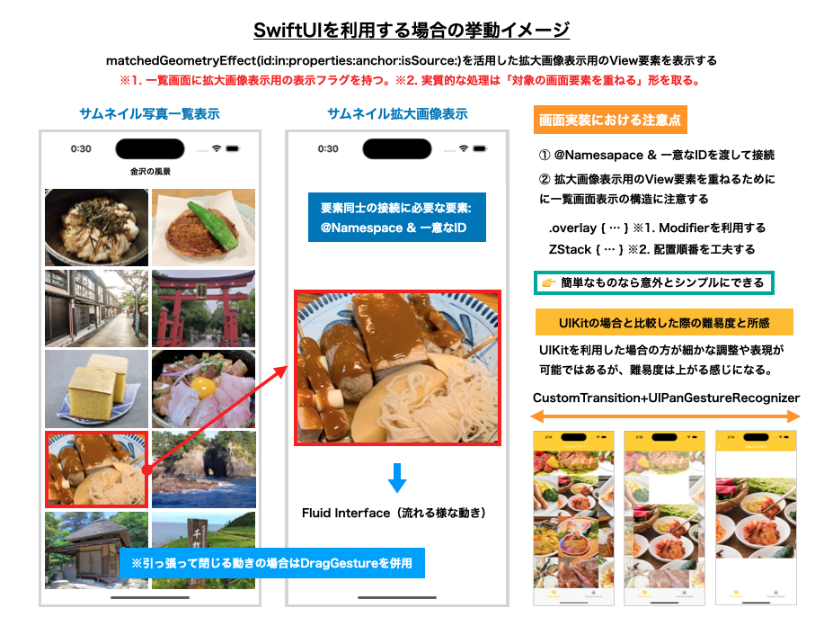

# はじめに

(こちらは、GMOインターネットグループ有志による技術同人誌に寄稿した原稿になります。)

## 1. はじめに

GMOペパボ株式会社の「ふみー」こと酒井文也と申します。普段はminne（ミンネ）事業部にて国内最大級のハンドメイドマーケットアプリ「minne」のモバイルアプリ開発に携わっており、現在ではiOS＆Androidアプリ双方の開発を担当しております。最近では、minneのモバイルアプリ開発を中心に据えつつ、過去のバックエンドエンジニアとしての経験を活かしてモバイルアプリに関連するRails実装コードの調査を行いました。また、業務外での活動として、モバイルアプリ開発に関連する勉強会への登壇や、技術書同人誌博覧会のコアスタッフを務めています。

モバイルアプリのUI実装に興味を持ったきっかけは、「CustomTransitionを活用して画面遷移をカスタマイズするUI表現」でした。当時、UIKitを含むiOSアプリ開発に関する知識やスキルも頼りない状態でしたが、その様な中での試行錯誤を経て実現できた時の感動は今でも覚えています。この様に、以前よりCustomTransition関連処理の調査やサンプル実装をした経験もあり、「iOSアプリの勉強を始めた際の憧れの実装」の基本事項をこの機会に改めてポイントを整理しておきたいと思い立ったのかもしれませんね。

※ minneのiOSアプリ内でも、作品一覧画面から詳細画面へ画面遷移する際のアニメーションでCustomTransitionを利用した処理が実装されています！

本章では、UIKitを利用した場合のCustomTransitionを活用した画面遷移のカスタマイズするための処理に関する基本事項やポイントを整理できればと思います。加えて、

1. SwiftUIでも同様ないしは類似した形の表現が実現できるか?
2. Android・Flutterでは同様ないしは類似した形の表現する場合の方針はどうなるか?

の2点についても触れたいと思います。

このプロジェクトを始めた主な動機は、iOSアプリ開発における画面遷移の仕組みや考え方がSwiftUIとUIKitで大きく異なるため、これらの違いを考慮して同様の画面遷移アニメーションを実現するための重要ポイントを理解する必要があったからです。また、iOSアプリ開発に加えてAndroidアプリの開発も行っており、将来的にはFlutterにも取り組みたいと考えています。そのため、iOSとAndroidの相違点を把握することで、異なるプラットフォーム間での比較を容易にするという目的もありました。

## 2. UIKitを利用時のCustomTransition処理が難しい点

UIKitを使用してCustomTransitionで画面遷移アニメーションをカスタマイズする場合、以下の3つのプロトコルと1つのクラスの理解が不可欠です。

__【2-1. UIViewControllerAnimatedTransitioning】__

こちらは、画面遷移時のアニメーションを定義するためのProtocolになります。[^1]

https://developer.apple.com/documentation/uikit/uiviewcontrolleranimatedtransitioning


__【2-2. UIViewControllerContextTransitioning】__

こちらは、画面遷移コンテキストを伝えるためのProtocolになります。[^2]

※すなわち、画面遷移時アニメーションをカスタマイズする際に必要な情報を伝えるためのものと言って差し支えないかと思います。

[^2]: https://developer.apple.com/documentation/uikit/uiviewcontrollercontexttransitioning

__【2-3. UIViewControllerTransitioningDelegate】__

こちらは、画面遷移時の進む場合と戻る場合の処理を実装するためのProtocolになります。[^3]

[^3]: https://developer.apple.com/documentation/uikit/uipercentdriveninteractivetransition

__【2-4. UIPercentDrivenInteractiveTransition】__

こちらは、インタラクティブな画面遷移を実装するためのClassになります。[^4]

※このクラスを継承し、UIPanGestureRecognizer・UIScreenEdgePanGestureRecognizerの処理と組み合わせて利用します。

[^4]: https://developer.apple.com/documentation/uikit/uipercentdriveninteractivetransition

これらの処理を効果的に活用することで、画面遷移時のアニメーションをカスタマイズし、指の動きに追従する滑らかで一貫性のある画面遷移を実現できます。しかし、特に複雑なアニメーションを設計する場合、考慮すべき多くの要素があります。

__【余談. 取り組み始めた時に難しく感じた点】__

1. メソッド名が長くて引数が多い＆名前も類似した物が多いので紛らわしく感じる
2. 位置を調整するための処理が複雑でシビアなものになりがちである
3. アニメーション処理に必要な値・要素を取得するための処理が面倒な場合がある
4. 画面遷移アニメーション処理でView要素を追加した際は忘れずにその要素を削除する

コードを見ただけでは、実装が要件を満たしているかの確認が難しいことがあります。そのため、デバッグ時には実機での確認と調整をこまめに行う必要があります。

## 3. UIKitを利用時のCustomTransitionの基本事項整理＆復習

まずは、CustomTransition処理において最低限押さえるべき事項を確認するために「Present/Dismiss」の画面遷移時において画面要素の大きさやアルファ値を変化させるアニメーション実装について考えてみます。NSObjectを継承し、`UIViewControllerAnimatedTransitioning`に準拠したクラスを準備します。そして、`func animateTransition(using transitionContext: UIViewControllerContextTransitioning) {...}`の処理内で、画面遷移時に実行したいアニメーション処理を組み立てていく様な流れとなります（※必要に応じて、画面遷移処理前に遷移元の値が必要な場合はクラス内に定義した変数を利用する形にすると良さそうに思います）。`UIViewControllerContextTransitioning`では、遷移元及び遷移先の情報が格納されているので、

1. 両方の画面View要素を取得する
2. ContainerViewへfromView・toViewを場合に応じて追加する → 例. 進む遷移:toView / 戻る遷移:fromView
3. 必要な値や要素等を適用した後にアニメーション処理を実行する

という処理方針となります。

これらの点を踏まえた、画面遷移アニメーション処理作成クラスの実装イメージは、後述するコードの様な形となります。

```swift
class DetailTransition: NSObject {

    // ※その他画面遷移をカスタマイズする為に必要な変数値を定義する
    // → 画面遷移処理を組み立てるに当たって必要な数値や要素を外部から渡せる様にしておくと良いです。
    // 例. トランジションの方向を決定するための値や位置・サイズ情報等。

    // トランジションの方向(present: true, dismiss: false)
    var presenting: Bool = true

    // アニメーション対象なるViewControllerの位置やサイズ情報を格納する変数
    var originalFrame: CGRect = CGRect.zero
}

// MARK: - UIViewControllerAnimatedTransitioning

extension DetailTransition: UIViewControllerAnimatedTransitioning {

    // アニメーションの時間を定義する
    func transitionDuration(using transitionContext: UIViewControllerContextTransitioning?) -> TimeInterval {
        return 0.28
    }

    // アニメーションの実装を定義する
    // 画面遷移コンテキスト(UIViewControllerContextTransitioning)を利用する 
    // → 遷移元や遷移先のViewController等の関連情報が格納されている
    func animateTransition(using transitionContext: UIViewControllerContextTransitioning) {

        // コンテキストを元にViewのインスタンスを取得する（存在しない場合は処理を終了）
        guard let fromView = transitionContext.view(forKey: UITransitionContextViewKey.from) else { return }
        guard let toView = transitionContext.view(forKey: UITransitionContextViewKey.to) else { return }

        // アニメーションの実体となるContainerViewを作成する
        let container = transitionContext.containerView

        // カスタムトランジションでViewControllerを表示させるViewの表示に関する値を格納する変数
        var toViewAlpha: CGFloat!
        var beforeTransitionImageViewFrame: CGRect!
        var afterTransitionImageViewFrame: CGRect!
        var afterTransitionViewAlpha: CGFloat!

        // (省略) 変数: presenting の値に応じて、前述した変数の値を決定する

        // アニメーションの実体となるContainerViewに必要なものを追加する
        containerView.addSubview(fromView)
        containerView.addSubview(toView)
        containerView.bringSubviewToFront(targetView)

        UIView.animate(withDuration: duration, delay: 0.00, options: [.curveEaseOut], animations: {

            // (省略) 変数: presenting の値に応じて、適用するアニメーション処理を変更する

            // アニメーションで変化させる値を決定する（例. 大きさやアルファ値）
            targetView.frame = self.originalFrame
            targetView.alpha = targetAlpha

        }, completion:{ _ in

            // 遷移元のViewControllerを表示しているViewは消去しておく
            fromView.removeFromSuperview()
            transitionContext.completeTransition(true)
        })
    }
}
```

次にPresent/Dismissでの画面遷移時において、先程作成したCustomTransitionに関するクラスを適用する際は、`UIViewControllerTransitioningDelegate`の処理を利用してアニメーションを適用します。`DetailTransition`クラス内では、画面遷移元の情報を利用して「進む・戻る場合の両方のアニメーション処理」を実装しているので、後述するコードの様な形となります。

```swift
// MARK: - UIViewControllerTransitioningDelegate

// MEMO: MainViewControllerクラスのプロパティとして予め定義しておく
// → private let detailTransition = DetailTransition()
extension MainViewController: UIViewControllerTransitioningDelegate {

    // 進む場合のアニメーションの設定を行う
    func animationController(
        forPresented presented: UIViewController, 
        presenting: UIViewController, 
        source: UIViewController
    ) -> UIViewControllerAnimatedTransitioning? {

        // アニメーション処理に必要な値をこのタイミングで引き渡す
        detailTransition.originalFrame = self.view.frame
        detailTransition.presenting = true
        return detailTransition
    }
    
    // 戻る場合のアニメーションの設定を行う
    func animationController(
        forDismissed dismissed: UIViewController
    ) -> UIViewControllerAnimatedTransitioning? {

        // 今回の場合は進む場合と逆のアニメーション処理を定義している想定
        detailTransition.presenting = false
        return detailTransition
    }
}
```

このように、CustomTransitionを効果的に実装するには、画面情報を活用してアニメーション処理を定義したクラスを作成し、それを遷移元のViewControllerが画面遷移を実行するタイミングで適用します。この流れを把握することで、全体の構成がより理解しやすくなるのではないかと思います。

## 4. UINavigationControllerを伴う画面遷移をカスタマイズ時のポイント

次に、UICollectionViewを利用してサムネイル画像を一覧表示している画面上から、CustomTransitionを利用してサムネイル画像が浮かび上がってくる様なアニメーション処理を「Push/Pop」の画面遷移時に加えるための実装について考えてみます。



このような動きを実現するため、画面遷移アニメーションクラスの実装では、遷移元からサムネイル画像や位置情報などの要素を取得し、これらを画面遷移のアニメーションで活用することが重要です。

この点を踏まえた、画面遷移アニメーション処理作成クラスの実装イメージは、後述するコードの様な形となります。

```swift
class DetailTransition: NSObject {

    // アニメーション対象となる画像のtag番号(遷移先のUIImageViewに付与する)
    private let customAnimatorTag = 99

    // トランジションの秒数
    private let duration: TimeInterval = 0.28

    // トランジションの方向(push: true, pop: false)
    var presenting: Bool = true

    // アニメーション対象なるViewControllerの位置やサイズ情報を格納するメンバ変数
    var originFrame: CGRect = CGRect.zero

    // アニメーション対象なるサムネイル画像情報を格納するメンバ変数
    var originImage: UIImage = UIImage()
}

// MARK: - UIViewControllerAnimatedTransitioning

extension DetailTransition: UIViewControllerAnimatedTransitioning {

    // アニメーションの時間を定義する
    func transitionDuration(using transitionContext: UIViewControllerContextTransitioning?) -> TimeInterval {
        return duration
    }

    // アニメーションの実装を定義する
    // 画面遷移コンテキスト(UIViewControllerContextTransitioning)を利用する
    // → 遷移元や遷移先のViewControllerやそのほか関連する情報が格納されているもの
    func animateTransition(using transitionContext: UIViewControllerContextTransitioning) {

        // コンテキストを元にViewのインスタンスを取得する（存在しない場合は処理を終了）
        guard let fromView = transitionContext.view(forKey: UITransitionContextViewKey.from) else {
            return
        }
        guard let toView = transitionContext.view(forKey: UITransitionContextViewKey.to) else {
            return
        }

        // アニメーションの実体となるContainerViewを作成する
        let container = transitionContext.containerView

        // 表示させるViewControllerを格納するための変数を定義する
        var detailView: UIView!

        // Case1: 進む場合
        if presenting {

            container.addSubview(toView)
            detailView = toView

        // Case2: 戻る場合
        } else {

            container.insertSubview(toView, belowSubview: fromView)
            detailView = fromView
        }

        // 遷移先のViewControllerに配置したUIImageViewのタグ値から、カスタムトランジション時に動かすUIImageViewの情報を取得する
        // ※ 今回はDetailViewController内に配置したtransitionTargetImageViewが該当する
        guard let targetImageView = detailView.viewWithTag(customAnimatorTag) as? UIImageView else {
            return
        }
        targetImageView.image = originImage
        targetImageView.alpha = 0

        // カスタムトランジションでViewControllerを表示させるViewの表示に関する値を格納する変数
        var toViewAlpha: CGFloat!
        var beforeTransitionImageViewFrame: CGRect!
        var afterTransitionImageViewFrame: CGRect!
        var afterTransitionViewAlpha: CGFloat!

        // Case1: 進む場合
        if presenting {

            toViewAlpha = 0
            beforeTransitionImageViewFrame = originFrame
            // MEMO: 詳細画面の初期配置位置に重なる様にframe値を設定する
            // targetImageView.frameを設定するとStoryboardの値が基準となる
            afterTransitionImageViewFrame  = CGRect(
                x: 0,
                y: 0,
                width: UIScreen.main.bounds.width,
                height: UIScreen.main.bounds.width * 0.75
            )
            afterTransitionViewAlpha = 1

        // Case2: 戻る場合
        } else {

            toViewAlpha = 1
            beforeTransitionImageViewFrame = targetImageView.frame
            afterTransitionImageViewFrame  = originFrame
            afterTransitionViewAlpha = 0
        }

        // 遷移時に動かすUIImageViewを追加する
        let transitionImageView = UIImageView(frame: beforeTransitionImageViewFrame)
        transitionImageView.image         = originImage
        transitionImageView.contentMode   = .scaleAspectFill
        transitionImageView.clipsToBounds = true
        container.addSubview(transitionImageView)

        // 遷移先のViewのアルファ値を反映する
        toView.alpha = toViewAlpha
        toView.layoutIfNeeded()

        UIView.animate(withDuration: duration, delay: 0.00, options: [.curveEaseInOut], animations: {
            transitionImageView.frame = afterTransitionImageViewFrame
            detailView.alpha = afterTransitionViewAlpha
        }, completion: { _ in
            transitionContext.completeTransition(!transitionContext.transitionWasCancelled)
            transitionImageView.removeFromSuperview()
            targetImageView.alpha = 1
        })
    }
}
```

また、UINavigationControllerを利用している画面で、画面左端からのスワイプによって遷移元に戻る際には、スワイプの進行度に応じて動的に変化するインタラクティブ（InteractiveTransition）な遷移が行われます。このような場合、`UIPercentDrivenInteractiveTransition`を継承したクラスを作成し、`UIScreenEdgePanGestureRecognizer`を用いてスワイプ操作を適切に扱うことが求められます。

この点を踏まえた、遷移元の画面へ戻る左端スワイプを考慮したInteractiveTransitionに関するクラスの実装イメージは、後述するコードの様な形となります。

```swift
class DetailInteractor: UIPercentDrivenInteractiveTransition {

    // UINavigationControllerを格納するための変数
    private var navigationController: UINavigationController

    // 画面遷移を完了するか否かの判定フラグ
    private var shouldCompleteTransition = false

    // 画面遷移の操作中であるか否かの判定フラグ
    var transitionInProgress = false

    // MARK: - Initializer

    init?(attachTo viewController: UIViewController) {
        if let nav = viewController.navigationController {
            self.navigationController = nav
            super.init()
            prepareGestureRecognizerInView(viewController.view)
        } else {
            return nil
        }
    }

    // MARK: - Private Function

    // UIScreenEdgePanGestureRecognizerが発火した際のアクションを定義する
    @objc private func handleGesture(_ gesture: UIScreenEdgePanGestureRecognizer) {

        // X軸方向の変化量を算出する
        let viewTranslation = gesture.translation(in: gesture.view?.superview)
        let progress = viewTranslation.x / self.navigationController.view.frame.width

        // UIScreenEdgePanGestureRecognizerの状態によって動き方の場合分けにする
        switch gesture.state {

        // 1.開始時
        case .began:
            transitionInProgress = true
            navigationController.popViewController(animated: true)
            break

        // 2.変更時
        case .changed:
            shouldCompleteTransition = (progress > 0.5)
            update(progress)
            break

        // 3.キャンセル時
        case .cancelled:
            transitionInProgress = false
            cancel()
            break

        // 4.終了時
        case .ended:
            transitionInProgress = false
            shouldCompleteTransition ? finish() : cancel()
            break

        default:
            print("This state is unsupported to UIScreenEdgePanGestureRecognizer.")
            return
        }
    }

    // UIScreenEdgePanGestureRecognizerを追加する
    private func prepareGestureRecognizerInView(_ view: UIView) {
        let gesture = UIScreenEdgePanGestureRecognizer(target: self, action: #selector(self.handleGesture(_:)))
        gesture.edges = .left
        view.addGestureRecognizer(gesture)
    }
}
```

最後にPush/Popの画面遷移において、先程作成したCustomTransition及びInteractiveTransitionクラスの適用は、`UINavigationControllerDelegate`を通じて行います。この適用における主要な考慮点は以下の通りです。

1. 遷移元の画面内ではアニメーションに必要な要素を画面のクラス内で保持する点
2. UICollectionViewで配置したセル要素をタップした際にアニメーション処理に必要な個々の要素を反映する点
3. UINavigationControllerの画面遷移プロセスにCustomTransitionとInteractiveTransitionクラスを統合する点

が、前述したPresent/Dismissでの画面遷移時の大きな相違点になるかと思います。

これらの点を踏まえた、画面遷移アニメーション処理作成クラスの実装イメージは、後述するコードの様な形となります。

```swift
// (1) 画面遷移元で配置しているUICollectionViewをセルをタップした際にセル内の画像情報を取得する処理

// MEMO: MainViewControllerクラスのプロパティとして予め定義しておく
// → private var selectedFrame: CGRect?
// → private var selectedImage: UIImage?

// MARK: - UICollectionViewDelegate, UICollectionViewDataSource

extension MainViewController: UICollectionViewDelegate, UICollectionViewDataSource {

    // ...（その他UICollectionViewDelegate / UICollectionViewDataSource関連処理は省略しています）...

    // UICollectionViewにおいて、任意のセルをタップした際に実行される処理
    func collectionView(_ collectionView: UICollectionView, didSelectItemAt indexPath: IndexPath) {
        let cell = collectionView.cellForItem(at: indexPath) as! MainCollectionViewCell

        // タップしたセルよりセル内の画像と表示位置を取得する
        selectedImage = cell.foodImageView.image
        // セル内の画像と表示位置の基準を変更してアニメーション開始位置を算出する
        selectedFrame = view.convert(cell.foodImageView.frame, from: cell.foodImageView.superview)

        // Storyboard名より遷移先画面のインスタンスを取得
        let storyboard = UIStoryboard(name: "Detail", bundle: nil)
        let controller = storyboard.instantiateInitialViewController() as! DetailViewController

        // 上記で作成した遷移先画面のインスタンスに必要なデータを引き渡す
        let food = foodList[indexPath.row]
        controller.setTargetFood(food)

        // 画面遷移を実行する際にUINavigationControllerDelegateの処理が実行される
        self.navigationController?.pushViewController(controller, animated: true)
    }
}

// (2) UINavigationControllerDelegateを利用してCustomTransition及びInteractiveTransitionを実行する処理

// MEMO: MainViewControllerクラスのプロパティとして予め定義しておく
// → private var detailInteractor: DetailInteractor?

// MARK: - UINavigationControllerDelegate

extension MainViewController: UINavigationControllerDelegate {

    func navigationController(
        _ navigationController: UINavigationController, 
        animationControllerFor operation: UINavigationController.Operation, 
        from fromVC: UIViewController, 
        to toVC: UIViewController
    ) -> UIViewControllerAnimatedTransitioning? {

        // カスタムトランジションのクラスに定義したプロパティへFrame情報とUIImage情報を渡す
        guard let frame = selectedFrame else { return nil }
        guard let image = selectedImage else { return nil }
        detailTransition.originFrame = frame
        detailTransition.originImage = image

        switch operation {
        case .push:
            // UIPercentDrivenInteractiveTransitionを継承したクラスをPushでの画面遷移時に適用する
            // → 遷移先画面の表示時に、左端をSwipeしてPop遷移を実行可能にする
            self.detailInteractor = DetailInteractor(attachTo: toVC)
            // Push遷移時は、(変数: presenting)をtrueへ変更する
            // → Cell表示位置から詳細画面内の画像表示位置へサムネイル画像が浮かび上がるアニメーションを実行する
            detailTransition.presenting = true
            return detailTransition
        default:
            // Push遷移時は、(変数: presenting)をfalseへ変更する
            // → 詳細画面内の画像表示位置からCell表示位置へサムネイル画像が元に戻っていくアニメーションを実行する
            detailTransition.presenting = false
            return detailTransition
        }
    }
}
```

Push/Pop画面遷移において、CustomTransition及びInteractiveTransitionを適用する際には、特に注意が必要です。適用するタイミングとアニメーションに必要な情報の取得方法は、技術的に難易度が高い部分です。これに比べ、Present/Dismiss画面遷移の場合は考慮すべき事項が少ないため、異なるアプローチが必要です。しかし、これらの技術を適切に活用することで、美しいアニメーションと効果的なインタラクションを実現できます。初めは簡単な事例で検証を行い、次第に様々な実装事例に触れることで、より具体的なイメージと深い理解を得ることができると思います。

※ 本章で紹介する実装手段以外では、OSS「Hero」[^5] [^6]を活用して同様の表現を実現する事も可能です。仕様や工数の兼ね合い等の事情によって自前でCustomTransitionに関連する処理を準備する事が難しい場合や、画面上の複数要素に対して画面遷移時のアニメーション処理を適用する実装を手軽に実現したい場合においては、利用を検討してみると良いかもしれません。

[^5]: https://github.com/HeroTransitions/Hero
[^6]: https://herotransitions.github.io/Hero/

最後に、CustomTransitionを活用した処理に関連しそうなアイデアに関する図解を掲載しておきますので、こちらも併せて参考にして頂けると幸いです。

__【補足1. ダミーのHeader要素を追加してScrollに追従する動きを実現する】__

こちらで紹介しているのは、UINavigationBar自体を拡張せずにNavigation表示部分をカスタマイズする際のアイデアになります。

UINavigationBar内部へ独自に作成したダミーのHeader要素を追加する事で、Scroll変化量と連動してダミーのHeader要素内部に@IBOutletに設定した制約を変化させる事で、あたかもスクロールに追従しながらタイトルが下から表示される様な演出をする点がポイントになります。だだし、UINavigationに関連する表示をカスタマイズする際は、遷移先の画面への影響や適用範囲についても十分に配慮が必要な点には注意が必要です。



__【補足2. View要素内の特定の情報を取得する方法例】__

CustomTransitionでの画面遷移アニメーションにおいて、遷移先の画面に配置したUI要素を取得することが重要です。たとえUI要素が@IBOutletで`private`に設定されている場合でも、タグ値を使用して情報を取得できます。

※ 図解ではGUI（Interface Builder）を利用した設定方法を掲載をしていますが、勿論コードでも設定可能です。


__【補足3. 画面を引っ張って閉じる動きを作る＆画面構造の工夫例】__

前述した様に、CustomTransitionを利用した画面遷移アニメーションと連動した画面に対して引っ張って閉じる動きを実現する際には、UIPanGestureRecognizer(UIScreenEdgePanGestureRecognizer)と組み合わせる方針を取りますが、もう1つ別のアイデアとして`func scrollViewDidScroll(_ scrollView: UIScrollView)`を利用して、Scroll変化量を取得した後にしきい値の判定を利用して実現する方法もあります。

CustomTransitionを利用した画面遷移アニメーションと引っ張って閉じる動作を組み合わせる事で、触り心地の良い形を演出する余地もありそうなので、私自身も今後とも機能と上手に調和する形は追求していきたいと思います。



また、画面全体をUIScrollViewで構成した画面において（補足1）の様にダミーのHeader要素を追加してScrollに追従する動きを実現する際は後述する図解の様な構成にしても良いかもしれません。この様な処理を考えていく際には、画面を構成するためのUI要素配置と更新対象となるAutoLayout制約を整理する事も重要な観点となります。



これらの点を踏まえた、Scroll変化量と連動するUI要素部分の実装イメージは、後述するコードの様な形となります。

```swift
// (1) 一覧詳細画面(※DetailViewController)内の当該処理内で利用するProperty一覧

// 下方向のスクロールを実施した際に画面を閉じる処理をするためのY軸方向のオフセット値のしきい値
private let dismissOffsetLimit: CGFloat = -100.0

// コンテンツ表示用のUIScrollView
@IBOutlet weak private var detailScrollView: UIScrollView!

// サムネイル画像のUIImageViewと制約値
@IBOutlet weak private var detailImageView: UIImageView!
@IBOutlet weak private var detailImageViewTopConstraint: NSLayoutConstraint!

// サムネイル画像の上にかぶせているマスク用のUIViewと制約値
@IBOutlet weak private var detailImageMaskView: UIView!
@IBOutlet weak private var detailImageMaskViewTopConstraint: NSLayoutConstraint!

// ダミーのNavigationBar表示をするDetailEffectiveHeaderViewと制約値
@IBOutlet weak private var detailEffectiveHeaderView: DetailEffectiveHeaderView!
@IBOutlet weak private var detailEffectiveHeaderHeightConstraint: NSLayoutConstraint!

// (2) 一覧詳細画面(※DetailViewController)内のScroll変化量に応じて当該要素の状態変化をさせる処理

// MARK: - UIScrollViewDelegate

extension DetailViewController: UIScrollViewDelegate {

    // スクロールが検知された時に実行される処理
    func scrollViewDidScroll(_ scrollView: UIScrollView) {

        let yOffset = scrollView.contentOffset.y

        // スクロールで変化する上方向のサムネイル画像の制約を更新する
        let targetConstant = -min(stickyOffsetLimit, yOffset)
        detailImageViewTopConstraint.constant = targetConstant
        detailImageMaskViewTopConstraint.constant = targetConstant

        // サムネイル画像に被せているマスク用Viewとダミータイトル表示用Viewのアルファ値を更新する
        let targetAlpha = yOffset / stickyOffsetLimit
        changeAlphaDetailImageMaskView(targetAlpha)
        detailEffectiveHeaderView.changeAlpha(targetAlpha)

        // Y軸方向のオフセット値がしきい値を超えていれば画面を閉じる
        if yOffset <= dismissOffsetLimit {
            dismissScreenDependOnVertialPosition()
        }
    }

    // 配置したマスク用のUIViewのアルファ値を変更する
    private func changeAlphaDetailImageMaskView(_ targetAlpha: CGFloat) {
        let maxAlpha: CGFloat = 0.64
        if targetAlpha > maxAlpha {
            detailImageMaskView.alpha = maxAlpha
        } else if 0...maxAlpha ~= targetAlpha {
            detailImageMaskView.alpha = targetAlpha
        } else {
            detailImageMaskView.alpha = 0
        }
    }

    // 配置したScrollViewのY軸方向のオフセット値のしきい値を超えた際に画面を閉じる
    private func dismissScreenDependOnVertialPosition() {

        // MEMO: カスタムトランジションに必要なFrame値を更新する
        dismissImageFrame = CGRect(
            x: 0,
            y: -detailScrollView.contentOffset.y,
            width: originalImageWidth,
            height: originalImageHeight
        )
        self.dismiss(animated: true, completion: nil)
    }
}
```

## 5. SwiftUI製のView要素やAndroid等での類似表現をするヒント

__【5-1. SwiftUI製のView要素でCustomTransitionの様な表現をするには？】__

`matchedGeometryEffect(id:in:properties:anchor:isSource:)`[^7]を利用する事によって、これまで解説してきた形の画面遷移アニメーションに類似した形を実現する事が可能です。

[^7]: https://developer.apple.com/documentation/swiftui/view/matchedgeometryeffect(id:in:properties:anchor:issource:)

```swift
func matchedGeometryEffect<ID>(
    id: ID,
    in namespace: Namespace.ID,
    properties: MatchedGeometryProperties = .frame,
    anchor: UnitPoint = .center,
    isSource: Bool = true
) -> some View where ID : Hashable
```

この部分では、UIKitを使用した方法とは異なり、SwiftUIでの画面遷移アニメーションをカスタマイズするアプローチについて説明します。SwiftUIでは、`@Namespace`プロパティラッパーと`一意なID`を用いて関連要素を結び付ける方法を採用しています。これにより、データリストから任意の要素を選択した際に、その要素が一覧画面と詳細画面で連動して表示されるようになります。この処理を実現するためのコード例は以下の通りです。

```swift
// 画面表示をするためのSwiftUI製のView要素な内部の処理概要
struct TrendArticlesGridView: View {

    // MARK: - Property

    // 詳細画面に相当するView要素を表示するかの判定フラグ値
    @State private var isExpanded: Bool = false
    // .matchedGeometryEffectを利用したアニメーション処理に必要となる名前空間
    @Namespace private var namespace
    // .matchedGeometryEffectを利用したアニメーション処理に必要となる一意なID
    @State private var targetProduct: Product?

    // ※1. Gridレイアウト定義用変数
    private let gridColumns = Array(
        repeating: .init(.flexible(), spacing: 8.0),
        count: 2
    )
    // ※2. 画面表示用のデータ一覧格納用変数
    private var products = getAllProducts()

    // MARK: - Body

    var body: some View {
        ScrollView(.vertical, showsIndicators: false) {
            // LazyVGridを利用して複数要素を一覧表示する
            LazyVGrid(columns: gridColumns, spacing: 8.0) {
                ForEach(products) { product in
                    // 詳細表示用View画面に配置したAnimation対象と結び付ける
                    // → ① GridElementView内の要素に下記の様に、.matchedGeometryEffectを付与する
                    // → ② .matchedGeometryEffect(id: product.id, in: animationID)
                    GridElementView(product: product, animationID: namespace)
                        .frame(height: 360.0)
                        .contentShape(Rectangle())
                        .onTapGesture {
                            .withAnimation(.linear(duration: 0.36)) {
                                // 一覧表示要素をタップした時は、@Stateを変更してView要素を再描画する
                                targetProduct = products
                                isExpanded = true
                            }
                        }
                }
            }
        }
        .overlay {
            if let targetProduct, isExpanded {
                // 一覧表示用View要素に配置したAnimation対象と結び付ける
                // → ① 表示処理時に一意なIDとnamespaceを引き渡す形とする
                // → ② View内には、var animationID: Namespace.ID が定義されている
                // → ③ このView要素を表示する際に、GridElementView内の要素がアニメーションする形で表示される
                DetailView(targetProduct: $targetProduct, animationID: namespace)
            }
        }
    }
}
```



※参考資料はこちらになります。

- Using matchedGeometryEffect to Create View Animations[^8]
- Matched Geometry Effect[^9]
- Advanced Matched Geometry Effect[^10]
- MatchedGeometryEffect – Part1[^11]
- MatchedGeometryEffect – Part2[^12]
- 記事内で紹介されているサンプル実装例[^13]

[^8]: https://www.appcoda.com/learnswiftui/swiftui-matchedgeometry.html
[^9]: https://designcode.io/swiftui-handbook-matched-geometry-effect
[^10]: https://designcode.io/swiftui-handbook-advanced-matched-geometry
[^11]: https://swiftui-lab.com/matchedgeometryeffect-part1/
[^12]: https://swiftui-lab.com/matchedgeometryeffect-part2/
[^13]: https://github.com/swiftui-lab/swiftui-hero-animations-no-transitions

__【5-2. Androidでの画面遷移時のアニメーション処理例】__

※ 本章ではAndroidアプリ開発においてXMLを利用したレイアウトを利用している想定で、2つのActivity間における画面遷移処理を想定したものになります。

このアプローチでは、アニメーションを活用して遷移先のActivityを表示します。具体的には、「Shared Element Transition」を利用し、画面遷移元と遷移先の要素に共通な一意のキー（例えば、"transitionName"等の様な文字列）を設定します。この一意のキー設定により、遷移の際に視覚的に連続性を持たせることが可能です。遷移を開始するには、適切に設定されたIntentを発行します。この方法は、iOSのOSSライブラリ「Hero」と類似しており、アニメーションの詳細な調整や制御が必要ない場合に特に扱いやすいです。

```java
// ProductListActivity.kt内における画面遷移処理部分のコード抜粋

// RecyclerView等を利用して表示している一覧表示要素のViewを取得する
val itemGridView = findViewById<View>(R.id.item_grid)

// RecyclerView等を利用して表示している一覧表示要素内のサムネイル画像表示要素を取得する
val itemThumbnailImageView = findViewById<View>(R.id.item_thumbnail_image)

// 一覧表示要素のViewをクリックした際の処理を設定する
itemGridView.setOnClickListener {

    val intent = Intent(this, ProductDetailActivity::class.java)
    // 画面遷移時のIntent発行タイミングで文字列を引き渡す
    // アニメーション処理対象の要素については`Pair.create`で複数指定する事も可能です。
    val options = ActivityOptionsCompat.makeSceneTransitionAnimation(this, image1, "transition_to_move_detail")
    // 画面遷移処理を開始する
    // ※ 予めProductDetailActivity.kt内の関連付ける要素に対しても"transition_to_move_detail"を設定しておく。
    startActivity(intent, options.toBundle())
}
```

※参考資料はこちらになります。

- Shared Element Activity Transition, Android(Kotlin).[^14]
- アニメーションを使ってアクティビティを開始する[^15]
- ユーザ体験を維持した遷移アニメーションの実装[^16]

[^14]: https://medium.com/@mandvi2346verma/shared-element-activity-transition-android-kotlin-8e235456039
[^15]: https://developer.android.com/develop/ui/views/animations/transitions/start-activity
[^16]: https://developers.cyberagent.co.jp/blog/archives/9291/

__【5-3. Flutterでの画面遷移時のアニメーション処理例】__

Flutterで画像がタップ時に大きくなりながら画面遷移するアニメーションを実装するには、遷移元と遷移先の両画面に配置されたアニメーション対象の要素に`Hero`ウィジェットを適用します。このウィジェットの利用方法や実装方針は、公式ドキュメントで詳しく解説されています。本章ではその詳細な解説を割愛しますが、iOSのOSSライブラリ「Hero」と同様に、直感的でシンプルな方法でサムネイル画像が浮かび上がるようなアニメーションを実現できる点が個人的にありがたいと感じております。

- Hero animations (Flutter Official Document)[^17]

[^17]: https://docs.flutter.dev/ui/animations/hero-animations

## 6. まとめ

UIKit利用時におけるCustomTransitionを利用した画面遷移アニメーションのカスタマイズ処理は、利用するメソッド名も長い＆類似した名前が多いため、最初は複雑で取っ付きづらい印象を持つかもしれませんが、カスタマイズ方法を知った上でその表現を上手に応用または活用する事によって、モバイルアプリ内における心地よい表現や体験・アクセントとなる要素を追加する事ができます。本章で紹介した処理やコード例については、画面遷移アニメーションを実現するために最低限押さえておきたい処理のポイントになりますが、理解を進めていくにあたっては、

1. `(Protocol) UIViewControllerAnimatedTransitioning`
2. `(Protocol) UIViewControllerContextTransitioning`
3. `(Protocol) UIViewControllerTransitioningDelegate`
4. `(Class) UIPercentDrivenInteractiveTransition`

に関する基本事項を理解し、まずはPresent/Dismissの画面遷移をカスタマイズするサンプル実装例に触れる事から始めていく様にすると良さそうに思います。

また、UINavigationControllerを伴うPush/Popの画面遷移をカスタマイズする際においては、UINavigationControllerDelegateでの処理と組み合わせる必要がある点や、UI表現や実装次第ではUINavigationBar等に対してカスタマイズを加えたり、やむを得ずダミーのHeader要素等を追加する等のイレギュラーな調整が必要な場合もある点が、一筋縄ではいかない難しい部分だと感じています。

※ できれば、UINavigationに関係するView要素に対してカスタマイズをなるべくしない方針にしていくのが望ましいと考えています。

UIKitの画面遷移処理については、各種アニメーションに関する処理に加えて、UIPanGestureRecognizer等を組み合わせる事によって、指の動きとも連動した画面を閉じる処理を実現可能です。これらの表現を上手に活用する事で得られる「画面遷移処理と連動した滑らかで触り心地の良いアニメーションやインタラクションを伴った演出」は、モバイルアプリ開発における大きな醍醐味の1つと言えます。

__【補足. 画面遷移とインタラクションを伴う処理の参考資料】__

- 触り心地の良いInteractiveTransitionをマスターしよう[^18] (※iOSDC2017での「shunkitan様」の登壇内容になります!)

[^18]: https://speakerdeck.com/shunkitan/hong-rixin-di-falseliang-i-interactive-transitionwomasutasiyou-iosdc-2017

一方で、SwiftUIを利用した場合は画面遷移処理をカスタマイズするという考え方ではなく、`matchedGeometryEffect(id:in:properties:anchor:isSource:)`を利用して、「一覧画面から詳細画面へ画面遷移をしている様に見せるためのアニメーション処理を関連する要素を結びつける様な形で実行している」点が、UIKit利用時におけるCustomTransitionを利用した画面遷移アニメーションとの大きな相違点だと思います。前述した`UIViewControllerAnimatedTransitioning`を利用した処理はSwiftUIで作られたView要素では利用できないため、「一覧画面の上にアニメーションを伴って詳細画面を表示させる」様なイメージになるかと思います。実現するためのコード量自体はUIKit利用時におけるCustomTransitionを利用した画面遷移アニメーションのカスタマイズ処理の場合と比べて、`@Namespace`と`一意なID`を利用する事で表示時の要素を接続する様な形となるので、アニメーション処理自体はシンプルにできる場合もあるかと思います。

一方で、Androidアプリ開発においてXMLを利用したレイアウトを利用してActivity間における画面遷移処理をカスタマイズする場合は、「Shared Element Transition」を利用する方針となります。こちらも画面遷移そのものをカスタマイズするのではなく、遷移元および遷移先に配置したアニメーション対象要素に対して`共通な一意のKeyとなる値(※一意なIDと言っても差し支えない)`を指定した上で画面遷移処理を実行する形となっています（考え方によってはSwiftUIを利用した際のアニメーション処理と考え方自体は近しいかもしれません）。

また、Flutterではタップした画像が大きくなったり移動したりしながら画面遷移の動きをするアニメーションを実現する際には、遷移元および遷移先に配置したアニメーション対象要素に対して`Hero`ウィジェットを利用する事でシンプルに実現する事ができます。こちらに関しても、Androidの「Shared Element Transition」と似た様なイメージで`Hero`ウィジェットの`tag`プロパティに対して`共通な一意のKeyとなる値(※一意なIDと言っても差し支えない)`を設定する様な方針となります。

UIKit利用時におけるCustomTransitionを利用した画面遷移アニメーションのカスタマイズ処理と比較すると大きな違いはあるものの、SwiftUI製のView要素に適用する`matchedGeometryEffect`を利用したアニメーション処理と、Android(XMLレイアウト利用時)での画面遷移時のアニメーション処理やFlutterでのアニメーション処理を比較してみると、関連要素を結び付ける考え方は少し似ているかも知れません。

この様に、異なるOS間における同様な処理における実装方針や実現手段の相違点を比較しながら正しく理解することで、機能実装時における正確な見積もりや懸案事項の洗い出しが必要な場面においても大いに役に立つのではないかと考えております。

※ 今回は、iOS(UIKit & SwiftUI) / Android(XMLレイアウト利用時) / Flutter に関する概要の紹介がメインでしたが、今後はAndroid(Jetpack Composeレイアウト利用時)の類似した形のアニメーション処理の実装に関しても引き続き調査を進めていく予定です。

私自身も「機能と感覚が調和した体験」は利用しているユーザーは勿論ですが、モバイルアプリ開発者にとっても強く心に残るものであると考えています。Apple純正のアプリはもちろんですが、Pinterest・SnapChat・Spotify等をはじめとした普段活用しているモバイルアプリにおいても、本稿で紹介した様な画面遷移処理をカスタマイズしたアニメーション表現を取り入れている物は数多く存在します。使いやすい機能と共に素敵なUI表現がマッチする事によって得られた体験が、「参考にしたい」・「是非真似してみたい」という感情に繋がっている事を意識し、UI実装に向き合うテーマとしてキャッチアップを継続しながら、実装スキルや表現の幅を増やして行きたいと思う次第です。

